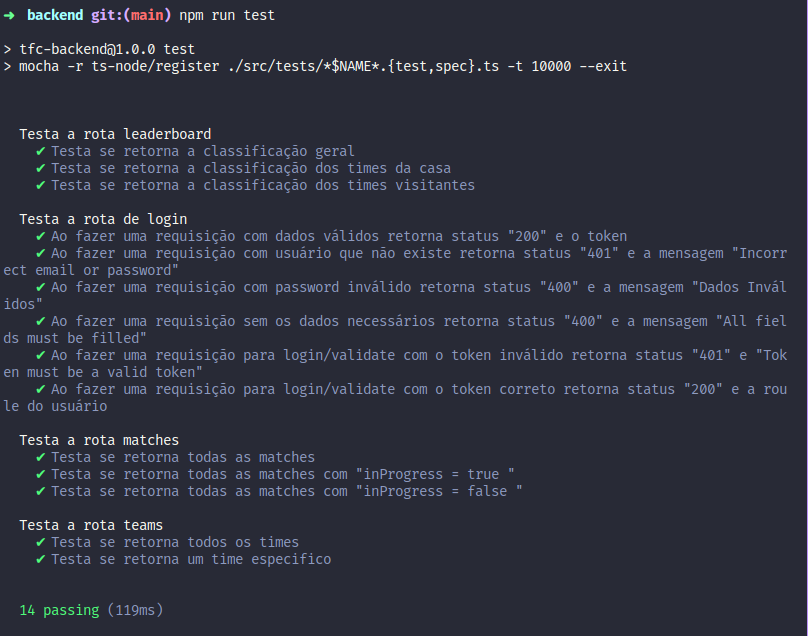

<h1 align="center">
  Trybe-Futebol-Clube
</h1>

### 📜 Sobre
- O TFC é um site informativo sobre partidas e classificações de futebol! ⚽️

### 🔽 Objetivos
- Desenvolver uma API (utilizando o método TDD) e também integrar - através do docker-compose - as aplicações para que elas funcionem consumindo um banco de dados.

### :rocket: Começando
1. ``$ git clone git@github.com:GuilhermeRX/Trybe-Futebol-Clube.git``
2. ``$ cd Trybe-Futebol-Clube``
3. ``$ npm install``
4. Inicialização do compose com script de apoio ``$ npm run compose:up``
    - Para dropar a aplicação você pode rodar ``$ npm run compose:down``
5. Para rodar os testes, abra um novo WorkSpace apartir de app/backend/ e em seguida ``$ npm run test``

### 🔒 Credenciais para logar na aplicação

  #### Administrador
    email: admin@admin.com
    password: secret_admin
  #### Usuário comum
    email: user@user.com
    password: secret_user
  
  #### Deploy Link
    https://trybefutebolclube.netlify.app/

### 🧰  Ferramentas utilizadas

  
  
   
  
  
  
  
  

**PS: O frontEnd da aplicação foi todo desenvolvido pelo time da Trybe

 Por Luiz Guilherme 💚

